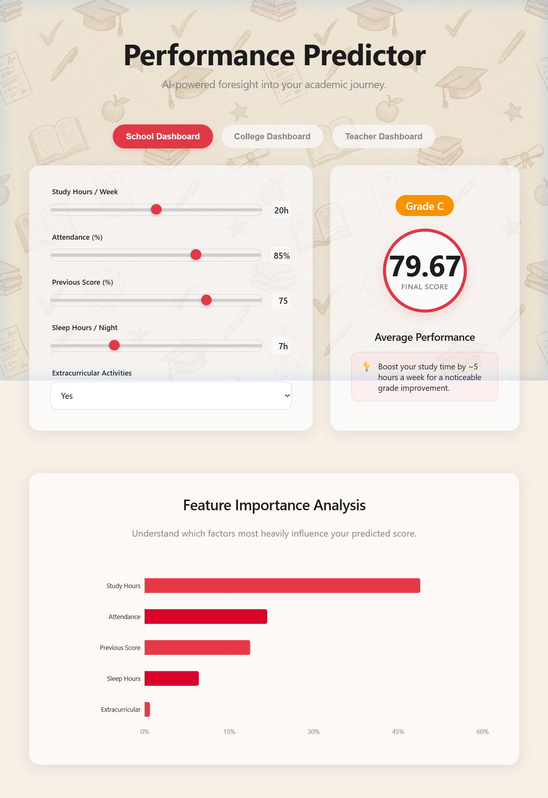
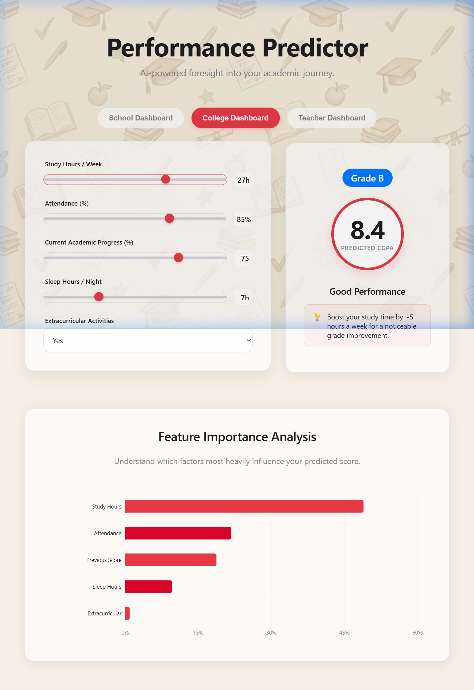
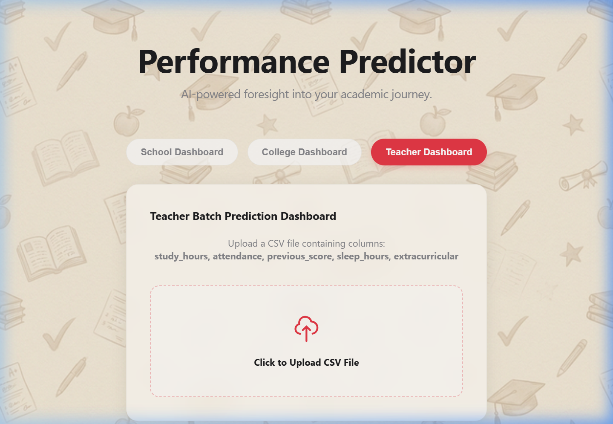
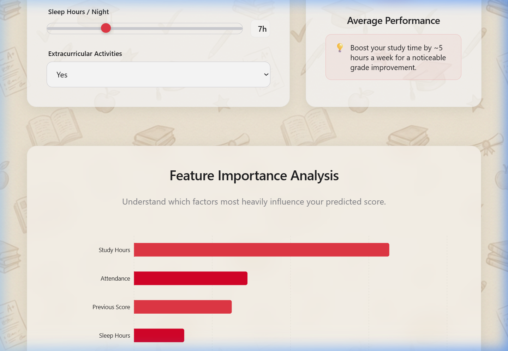

<p align="center">
  
  
  
  
  
</p>

<h1 align="center">🎓 Student Performance Predictor</h1>

<p align="center">
  <strong>AI-powered foresight into your academic journey</strong><br/>
  <em>Predict scores, visualize insights, and get actionable advice — all in real time.</em>
</p>

<p align="center">
  
</p>

---

## ✨ Features

| Feature | Description |
|---|---|
| 🏫 **School Dashboard** | Predict final exam scores based on study habits, attendance, and more |
| 🎓 **College Dashboard** | Get CGPA predictions tailored for college-level students |
| 👩‍🏫 **Teacher Dashboard** | Batch-predict performance for an entire class via CSV upload |
| 📊 **Feature Importance** | Interactive chart showing which factors impact grades the most |
| 💡 **Actionable Advice** | AI-generated tips to improve academic performance |
| ⚡ **Real-Time Updates** | Predictions update instantly as you adjust input sliders |

---

## 📸 Screenshots

### 🏫 School Dashboard — Score Prediction

Adjust sliders for study hours, attendance, previous scores, sleep, and extracurriculars. Get instant grade predictions with a visual score circle, grade badge, and personalized improvement advice.

<p align="center">
  
</p>

### 🎓 College Dashboard — CGPA Prediction

The College Dashboard adapts the prediction to output **CGPA (out of 10)** instead of a percentage score, giving college students a familiar metric.

<p align="center">
  
</p>

### 👩‍🏫 Teacher Dashboard — Batch Prediction

Teachers can upload a CSV file with student data and get batch predictions for the entire class. The results table highlights **at-risk students** who may need extra attention.

<p align="center">
  
</p>

### 📊 Feature Importance Analysis

Understand which academic factors have the highest impact on student performance through an interactive horizontal bar chart powered by the Random Forest model's feature importances.

<p align="center">
  
</p>

---

## 🏗️ Architecture

```
Student-Performance-Predictor/
├── backend/
│   ├── app.py                # Flask REST API server
│   ├── train.py              # Model training script (Random Forest)
│   ├── requirements.txt      # Python dependencies
│   └── model/
│       ├── student_model.pkl  # Trained model (serialized)
│       └── features.pkl      # Feature names (serialized)
├── frontend/
│   ├── src/
│   │   ├── App.jsx           # React components (Student, Teacher views)
│   │   ├── index.css         # Apple-inspired glassmorphism theme
│   │   └── main.jsx          # React entry point
│   ├── public/
│   │   └── bg.png            # Background texture
│   ├── package.json          # Node dependencies
│   └── vite.config.js        # Vite configuration
├── test_students.csv          # Sample CSV for batch prediction
└── README.md
```

---

## 🛠️ Tech Stack

| Layer | Technology |
|---|---|
| **Frontend** | React 19 + Vite 4 + Recharts |
| **Backend** | Python Flask + Flask-CORS |
| **ML Model** | Scikit-Learn (Random Forest Regressor) |
| **Data** | Pandas + NumPy |
| **Styling** | Custom CSS — Apple-inspired glassmorphism with animations |

---

## 🚀 Getting Started

### Prerequisites

- **Python 3.10+** installed
- **Node.js 18+** installed

### 1️⃣ Clone the Repository

```bash
git clone https://github.com/Sarankishore24/Student-Preformance-Predictor.git
cd Student-Preformance-Predictor
```

### 2️⃣ Set Up the Backend

```bash
cd backend

# Create a virtual environment
python -m venv venv

# Activate virtual environment
# Windows:
venv\Scripts\activate
# macOS/Linux:
source venv/bin/activate

# Install dependencies
pip install -r requirements.txt

# Train the model (generates model files)
python train.py

# Start the Flask server
python app.py
```

The backend API will be running at `http://127.0.0.1:5000`

### 3️⃣ Set Up the Frontend

Open a new terminal:

```bash
cd frontend

# Install dependencies
npm install

# Start the dev server
npm run dev
```

The frontend will be running at `http://127.0.0.1:5173`

---

## 🔌 API Endpoints

| Method | Endpoint | Description |
|---|---|---|
| `POST` | `/api/predict` | Predict score for a single student |
| `POST` | `/api/batch-predict` | Batch predict scores from CSV data |
| `GET` | `/api/insights` | Get feature importance data |
| `GET` | `/api/status` | Check if API and model are online |

### Example Request — Single Prediction

```json
POST /api/predict
{
  "study_hours": 25,
  "attendance": 90,
  "previous_score": 80,
  "sleep_hours": 7,
  "extracurricular": 1,
  "student_type": "school"
}
```

### Example Response

```json
{
  "predicted_score": 85.42,
  "grade": "B",
  "remarks": "Good Performance",
  "actionable_advice": "Boost your study time by ~5 hours a week for a noticeable grade improvement."
}
```

---

## 🤖 How the ML Model Works

The prediction engine uses a **Random Forest Regressor** trained on synthetically generated student data with realistic correlations:

1. **Features Used**:
   - `study_hours` — Weekly study hours (0–40)
   - `attendance` — Class attendance percentage (50–100%)
   - `previous_score` — Previous academic performance (0–100)
   - `sleep_hours` — Nightly sleep duration (4–10 hours)
   - `extracurricular` — Participation in activities (Yes/No)

2. **Grading Scale**:
   | Score Range | Grade | Remarks |
   |---|---|---|
   | 90–100 | A | Excellent Performance |
   | 80–89 | B | Good Performance |
   | 70–79 | C | Average Performance |
   | 60–69 | D | Below Average |
   | 0–59 | F | Needs Improvement |

3. **Actionable Advice**: The model simulates "what-if" scenarios (e.g., +5 study hours, +10% attendance) to generate personalized improvement tips.

---

## 📄 CSV Format for Batch Prediction

Use the following CSV format for the Teacher Dashboard:

```csv
study_hours,attendance,previous_score,sleep_hours,extracurricular
25,90,80,7,1
10,60,50,5,0
30,95,85,8,1
```

A sample file `test_students.csv` is included in the repository.

---

## 🤝 Contributing

Contributions are welcome! Feel free to:

1. Fork the repository
2. Create a feature branch (`git checkout -b feature/amazing-feature`)
3. Commit your changes (`git commit -m 'Add amazing feature'`)
4. Push to the branch (`git push origin feature/amazing-feature`)
5. Open a Pull Request

---

## 📜 License

This project is open source and available under the [MIT License](LICENSE).

---

<p align="center">
  Made with ❤️ by <a href="https://github.com/Sarankishore24">Sarankishore24</a>
</p>
